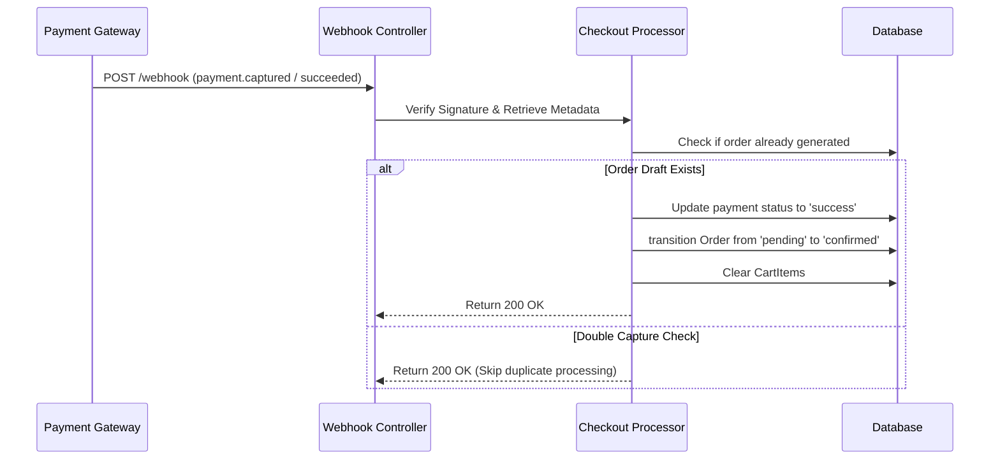

# Checkout Module Architecture Design

This document outlines the state flow, billing engines, local vendor assignment loops, tax rules, and payment integration architectures for the FuelCab checkout system.

---

## 1. Checkout Workflow State Machine

The checkout sequence coordinates stock reservations, address checks, tax calculation, and payment confirmation:

```
[ Cart Checkout Triggered ]
             |
             v
[ Step 1: Address Selection ]  ----> Validates distance and coverage parameters
             |
             v
[ Step 2: Vendor Bidding/Select ] -> Assigns nearest merchant or triggers matching
             |
             v
[ Step 3: Schedule Delivery ]  ----> Confirms date and time-slot compatibility
             |
             v
[ Step 4: Pricing & Taxes ]   ----> Computes base subtotal + delivery + GST
             |
             v
[ Step 5: Payment Gateway ]    ----> Dispatches token to Stripe/Razorpay
             |
             +-----> (Success) ----> [ Create Order & Clear Cart ]
             |
             +-----> (Failure) ----> [ Retain Cart & Flag Error ]
```

---

## 2. Local Vendor Assignment & Bidding Logic

Because logistics and transport costs vary based on geography, the checkout engine queries nearest merchants relative to the delivery address coordinates:

1. **Geographic Check**:
   - Extract latitude/longitude from selected `Address`.
   - Perform a radial query (`ServiceArea` checks) using spatial queries:
     ```sql
     SELECT vendor_id, (6371 * acos(cos(radians(:lat)) * cos(radians(latitude)) * cos(radians(longitude) - radians(:lng)) + sin(radians(:lat)) * sin(radians(latitude)))) AS distance
     FROM vendor_service_areas
     HAVING distance <= max_delivery_radius
     ORDER BY distance ASC;
     ```
2. **Delivery Fee Computation**:
   - `Delivery Fee = Base Logistics Fee + (Distance * Rate Per KM)`.

---

## 3. Tax Calculation Engine (GST Compliance)

Our pricing engine automatically splits taxes based on vendor and delivery addresses to comply with Indian GST laws:

- **Intrastate (SGST + CGST)**: If `Vendor State == Delivery Address State`.
  - CGST: 9%
  - SGST: 9% (Total 18% GST on Diesel logistics/service fees, base fuel varies by state regulations).
- **Interstate (IGST)**: If `Vendor State != Delivery Address State`.
  - IGST: 18%

---

## 4. API Endpoints

All actions require an authenticated user session token.

* `POST /api/v1/checkout/initialize`
  - Body: `{ "cart_id": "UUID" }`
  - Returns a draft checkout session ID with lock verification.
* `POST /api/v1/checkout/address`
  - Body: `{ "checkout_id": "UUID", "address_id": "UUID" }`
  - Validates delivery coverage area and computes initial delivery fee.
* `POST /api/v1/checkout/schedule`
  - Body: `{ "checkout_id": "UUID", "scheduled_delivery_at": "YYYY-MM-DD HH:MM:SS" }`
  - Validates delivery slot availability.
* `GET /api/v1/checkout/summary`
  - Retrieves subtotal, delivery fee, GST split, and grand total.
* `POST /api/v1/checkout/pay`
  - Body: `{ "checkout_id": "UUID", "payment_method": "razorpay | stripe | wallet" }`
  - Returns the payment gateway order signature, transactions token, and callback redirect URLs.

---

## 5. Webhook & Order Completion System

We utilize asynchronous webhook handlers to catch network disconnects during the payment stage:


