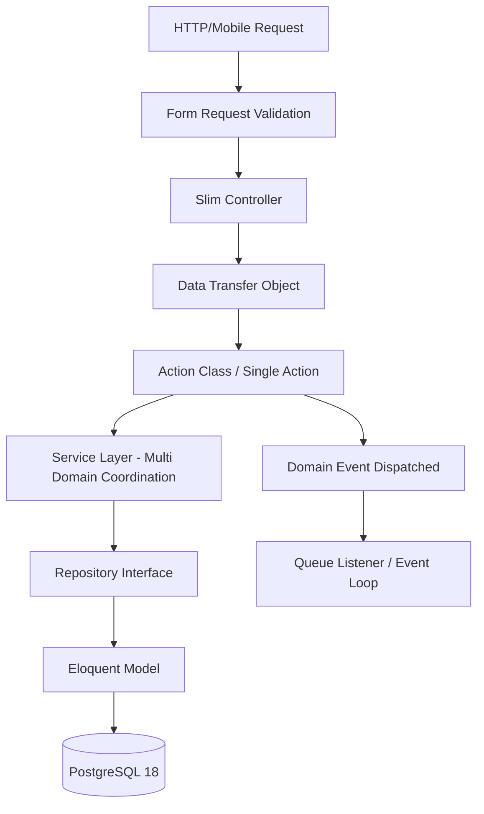

# FuelCab Enterprise-Grade Architecture Blueprint

This document defines the folder structure, design patterns, coding standards, and modular architecture guidelines for **FuelCab** (built with Laravel 12, PHP 8.4, and PostgreSQL 18).

---

## 1. Directory Tree & Modular Architecture

FuelCab implements a **Modular Domain-Driven Structure** instead of standard Laravel flat folders. This guarantees domain isolation and makes the codebase microservice-friendly.

```
app/
├── Models/                     # Core Global Shared Models (User, Address, Category, etc.)
├── Providers/                  # Application Bootstrap Providers
├── Traits/                     # Shared Behaviors (HasUuid, Auditable, Filterable)
└── Modules/                    # Domain Modules
    ├── Auth/                   # Authentication & OTP Flow
    ├── Fuel/                   # Products, FuelTypes, Inventories, Stock Logs
    ├── Driver/                 # Driver Verification, Earnings, Operations
    ├── Order/                  # Cart, Checkout, Order Actions
    ├── Payment/                # Wallets, Gateways, Ledger Logs
    └── Vendor/                 # Merchant Management, Radius Areas
        │
        # --- Internal Module Domain Layer Structure ---
        ├── Http/
        │   ├── Controllers/    # Slim API controllers
        │   ├── Requests/       # Form Request validations
        │   └── Resources/      # JSON API response transformers (DTO to API)
        ├── Services/           # Complex multi-entity business workflows
        ├── Actions/            # Single Responsibility Classes (SRCs)
        ├── DTOs/               # Data Transfer Objects for type-safety
        ├── Repositories/       # Database access layers (Interfaces & Eloquent bindings)
        ├── Models/             # Domain-specific database entities
        ├── Events/             # Internal domain events
        ├── Listeners/          # Action hooks responding to domain events
        ├── Jobs/               # Asynchronous queue processors
        └── Policies/           # Authorization logic (Abilities gates)
```

---

## 2. Design Patterns & Architectural Layers



### 1. API First & Mobile Ready
- All responses must inherit from `Illuminate\Http\Resources\Json\JsonResource` or `ResourceCollection`.
- Raw database arrays or Eloquent models are never exposed directly to external client integrations.
- API endpoints are versioned (`/api/v1/`, `/api/v2/`).

### 2. DTO (Data Transfer Objects)
- Prevent array mutation bugs by enforcing strict type definitions on payload data passed to Actions and Services.
- **Rule**: Controllers instantiate DTOs from validated request parameters.

### 3. Action Classes
- Solve controller bloating by encapsulating a single business transaction (e.g. `ApproveVendorAction`, `SubmitOrderAction`).
- **Rule**: Actions contain only one public method: `execute()`.

### 4. Service Layer
- Coordinates workflows that require crossing domain boundaries (e.g. executing payments, reducing stock, and generating notifications during checkout).

### 5. Repository Pattern
- Decouples business logic from Eloquent queries to enable clean unit testing.
- **Rule**: Services and Actions inject interfaces (e.g. `ProductRepositoryInterface`) rather than importing raw models directly.

---

## 3. Naming Conventions

Consistency across suffixes is required. 

| Component | Suffix | Location | Example |
| :--- | :--- | :--- | :--- |
| **Data Transfer Object** | `DTO` | `App/Modules/*/DTOs` | `CreateOrderDTO` |
| **Action Class** | `Action` | `App/Modules/*/Actions` | `SyncInventoryAction` |
| **Service Layer** | `Service` | `App/Modules/*/Services` | `CheckoutService` |
| **Repository Interface** | `RepositoryInterface` | `App/Modules/*/Repositories` | `ProductRepositoryInterface` |
| **Eloquent Repository** | `EloquentRepository` | `App/Modules/*/Repositories` | `EloquentProductRepository` |
| **API Resource** | `Resource` | `App/Modules/*/Http/Resources` | `ProductResource` |
| **Form Request** | `Request` | `App/Modules/*/Http/Requests` | `SyncInventoryRequest` |
| **Job (Queue)** | `Job` | `App/Modules/*/Jobs` | `SyncInventoryJob` |

---

## 4. Coding Standards

1. **Strict Typing**: Every file must declare strict typing at the top line:
   ```php
   <?php
   declare(strict_types=1);
   ```
2. **Type Hinting**: All function parameters, return values, and class properties must have explicit type declarations:
   ```php
   public function execute(CreateOrderDTO $dto): Order;
   ```
3. **Database Transactions**: Any Action or Service writing to multiple tables must wrap query operations inside a database transaction block:
   ```php
   DB::transaction(fn() => ...)
   ```
4. **Append-Only Auditing**: Ledger updates, stock modifications, and balance changes must write to an append-only log table rather than mutating inline rows blindly.
