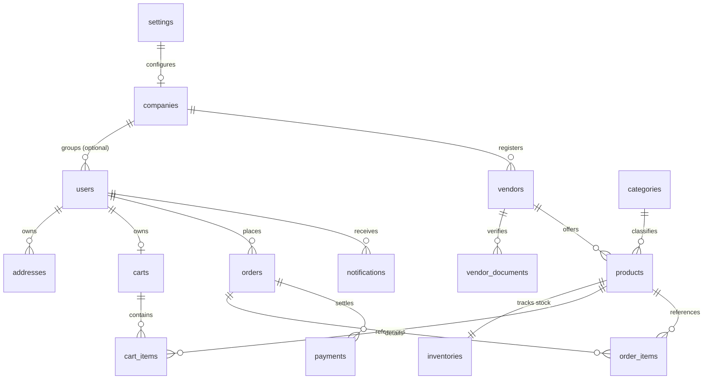

# PostgreSQL Database Schema Design (FuelCab MVP)

This document outlines the complete relational database design for the FuelCab MVP, including entity-relationship (ER) structures, key indexes, table relationships, and foreign constraints.

---

## 1. Entity-Relationship (ER) Diagram

---

## 2. Table Schemas & Configurations

All tables use PostgreSQL UUIDv4 identifiers as primary keys (`id uuid PRIMARY KEY DEFAULT gen_random_uuid()`).

### 1. `companies`
- `id` (uuid, PK)
- `name` (varchar, NOT NULL)
- `tax_number` (varchar, unique, nullable)
- `status` (varchar, default: 'active')
- `created_at` / `updated_at` / `deleted_at`

### 2. `users`
- `id` (uuid, PK)
- `company_id` (uuid, FK references `companies.id`, nullable)
- `name` (varchar, NOT NULL)
- `email` (varchar, unique, NOT NULL)
- `phone` (varchar, unique, nullable)
- `password` (varchar, NOT NULL)
- `status` (varchar, default: 'active')
- `created_at` / `updated_at` / `deleted_at`

### 3. `addresses`
- `id` (uuid, PK)
- `user_id` (uuid, FK references `users.id`, NOT NULL)
- `address_line_1` (varchar, NOT NULL)
- `address_line_2` (varchar, nullable)
- `city` (varchar, NOT NULL)
- `state` (varchar, NOT NULL)
- `postal_code` (varchar, NOT NULL)
- `latitude` (decimal, 10, 8)
- `longitude` (decimal, 11, 8)
- `created_at` / `updated_at`

### 4. `vendors`
- `id` (uuid, PK)
- `company_id` (uuid, FK references `companies.id`, unique, NOT NULL)
- `brand_name` (varchar, NOT NULL)
- `status` (varchar, default: 'pending')
- `commission_rate` (decimal, 5, 2, default: 0.00)
- `service_radius_meters` (integer, default: 5000)
- `created_at` / `updated_at` / `deleted_at`

### 5. `vendor_documents`
- `id` (uuid, PK)
- `vendor_id` (uuid, FK references `vendors.id`, NOT NULL)
- `document_type` (varchar) -- license, tax_id, safety_cert
- `file_path` (varchar, NOT NULL)
- `status` (varchar, default: 'pending')
- `created_at` / `updated_at`

### 6. `categories`
- `id` (uuid, PK)
- `name` (varchar, NOT NULL)
- `slug` (varchar, unique, NOT NULL)
- `description` (text, nullable)
- `created_at` / `updated_at` / `deleted_at`

### 7. `products`
- `id` (uuid, PK)
- `category_id` (uuid, FK references `categories.id`, NOT NULL)
- `vendor_id` (uuid, FK references `vendors.id`, NOT NULL)
- `name` (varchar, NOT NULL)
- `slug` (varchar, NOT NULL)
- `sku` (varchar, NOT NULL)
- `price_per_unit` (decimal, 12, 4, NOT NULL)
- `unit_of_measure` (varchar, default: 'liter')
- `is_active` (boolean, default: true)
- `status` (varchar, default: 'active')
- `created_at` / `updated_at` / `deleted_at`

### 8. `inventories`
- `id` (uuid, PK)
- `product_id` (uuid, FK references `products.id`, unique, NOT NULL)
- `vendor_id` (uuid, FK references `vendors.id`, NOT NULL)
- `quantity_available` (decimal, 12, 2, default: 0.00)
- `low_stock_threshold` (decimal, 12, 2, default: 100.00)
- `last_restocked_at` (timestamp, nullable)
- `created_at` / `updated_at` / `deleted_at`

### 9. `carts`
- `id` (uuid, PK)
- `user_id` (uuid, FK references `users.id`, nullable)
- `guest_token` (varchar, unique, nullable)
- `vendor_id` (uuid, FK references `vendors.id`, nullable)
- `created_at` / `updated_at`

### 10. `cart_items`
- `id` (uuid, PK)
- `cart_id` (uuid, FK references `carts.id`, NOT NULL)
- `product_id` (uuid, FK references `products.id`, NOT NULL)
- `quantity` (decimal, 12, 2, NOT NULL)
- `created_at` / `updated_at`

### 11. `orders`
- `id` (uuid, PK)
- `user_id` (uuid, FK references `users.id`, NOT NULL)
- `vendor_id` (uuid, FK references `vendors.id`, NOT NULL)
- `delivery_address_id` (uuid, FK references `addresses.id`, NOT NULL)
- `status` (varchar, default: 'pending')
- `total_price` (decimal, 12, 2, NOT NULL)
- `tax_amount` (decimal, 12, 2, default: 0.00)
- `delivery_fee` (decimal, 12, 2, default: 0.00)
- `scheduled_delivery_at` (timestamp, nullable)
- `created_at` / `updated_at`

### 12. `order_items`
- `id` (uuid, PK)
- `order_id` (uuid, FK references `orders.id`, NOT NULL)
- `product_id` (uuid, FK references `products.id`, NOT NULL)
- `quantity` (decimal, 12, 2, NOT NULL)
- `price_per_unit` (decimal, 12, 4, NOT NULL)
- `created_at` / `updated_at`

### 13. `payments`
- `id` (uuid, PK)
- `order_id` (uuid, FK references `orders.id`, NOT NULL)
- `payment_gateway` (varchar) -- razorpay, stripe, wallet
- `gateway_transaction_id` (varchar, unique, nullable)
- `amount` (decimal, 12, 2, NOT NULL)
- `status` (varchar, default: 'pending')
- `created_at` / `updated_at`

### 14. `notifications`
- `id` (uuid, PK)
- `user_id` (uuid, FK references `users.id`, NOT NULL)
- `title` (varchar, NOT NULL)
- `message` (text, NOT NULL)
- `is_read` (boolean, default: false)
- `created_at` / `updated_at`

### 15. `settings`
- `id` (uuid, PK)
- `company_id` (uuid, FK references `companies.id`, unique, nullable)
- `key` (varchar, NOT NULL)
- `value` (text, NOT NULL)
- `created_at` / `updated_at`

---

## 3. Indexes & Constraints Design

To ensure optimal performance, the following custom composite indexes are configured:

1. **`products`**:
   - Unique Index: `['vendor_id', 'sku']`
   - B-Tree Index: `['status', 'is_active']`
2. **`inventories`**:
   - Composite Index: `['vendor_id', 'product_id']`
3. **`carts`**:
   - Unique Index: `guest_token` (where not null)
4. **`orders`**:
   - B-Tree Index: `status`
   - Composite Index: `['user_id', 'created_at']`
