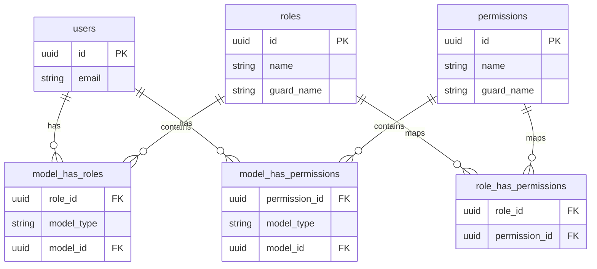

# Roles & Permissions Architecture Design (RBAC)

This document defines the Role-Based Access Control (RBAC) database schema, permission matrix, roles mapping, seeder logic, and authorization policies for FuelCab.

---

## 1. Database Schema Design (Spatie Laravel Permission)

We utilize the standard `spatie/laravel-permission` table structures linked to our UUID-based user entities.



---

## 2. Roles & Permissions Matrix

### System Roles
1. **Super Admin**: Complete platform configuration, system integrations, and global overrides.
2. **Operations Team**: Administrative backoffice staff managing verifications, order dispatch, and dispute settlement.
3. **Vendor Admin**: Owner-level account for a verified fuel dealership. Manages stock, staff, and logistics areas.
4. **Vendor Staff**: Operates refuelling dispatches, updates inventory levels, and views orders.
5. **Driver**: Delivery driver dispatch views, status reports (en route, refuelling, complete), and route details.
6. **Customer**: B2B merchant buyers who place orders, select delivery slots, and complete payments.

### Permission Mapping Table

| Permission | Super Admin | Operations | Vendor Admin | Vendor Staff | Driver | Customer |
| :--- | :---: | :---: | :---: | :---: | :---: | :---: |
| `manage_system_settings` | ✅ | ❌ | ❌ | ❌ | ❌ | ❌ |
| `approve_vendors` | ✅ | ✅ | ❌ | ❌ | ❌ | ❌ |
| `approve_drivers` | ✅ | ✅ | ❌ | ❌ | ❌ | ❌ |
| `manage_vendor_settings` | ✅ | ❌ | ✅ | ❌ | ❌ | ❌ |
| `create_users` | ✅ | ❌ | ✅ | ❌ | ❌ | ❌ |
| `track_drivers` | ✅ | ✅ | ✅ | ❌ | ❌ | ❌ |
| `manage_fuel_pricing` | ✅ | ✅ | ❌ | ❌ | ❌ | ❌ |
| `update_fuel_inventory` | ✅ | ✅ | ✅ | ✅ | ❌ | ❌ |
| `update_orders` | ✅ | ✅ | ✅ | ✅ | ✅ | ❌ |
| `create_orders` | ✅ | ❌ | ✅ | ✅ | ❌ | ✅ |
| `cancel_orders` | ✅ | ✅ | ✅ | ❌ | ❌ | ✅ |
| `view_wallets` | ✅ | ✅ | ✅ | ❌ | ✅ | ✅ |

---

## 3. Seeder Strategy

To avoid integrity clashes and duplicate records:
- **Registrar Reset**: Always clear the cached Spatie permissions using `app()[\Spatie\Permission\PermissionRegistrar::class]->forgetCachedPermissions()` at the start of the seeder.
- **Upsert Patterns**: Use `firstOrCreate()` to allow seeders to be run multiple times in staging and production environments without causing unique constraint key collisions.

---

## 4. Policy Strategy

All custom modular controllers enforce authorization checks using Laravel policies:

1. **Implicit Super Admin Access**: Register a `Gate::before` callback within `AppServiceProvider` to automatically bypass permission checks for the `SuperAdmin` role:
   ```php
   Gate::before(function ($user, $ability) {
       return $user->hasRole('super-admin') ? true : null;
   });
   ```
2. **Resource-Specific Policies**: Maps standard controller operations (`viewAny`, `view`, `create`, `update`, `delete`) to explicit permissions (e.g. `create_orders` check inside `OrderPolicy`).
3. **Tenant Boundary Checks**: Policies combine permission checks with model ownership validation to ensure a vendor user can only view resources linked to their own `vendor_id`.
